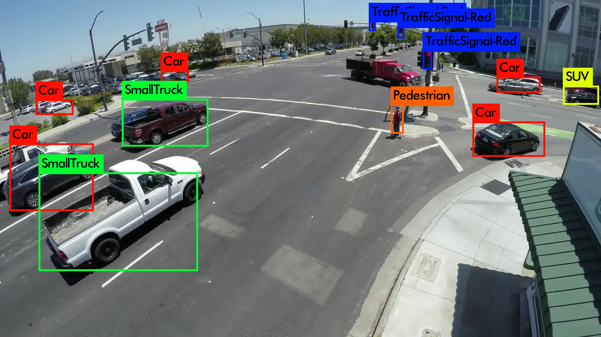

# traffic-object-detection
This project uses the NVIDIA Smart World AI City Challenge's dataset to train a convolutional neural network to recognize traffic objects.  Only a subset of the dataset with images from traffic cameras around Silicon valley were used for this project.

The classes used during training were:

    Car
    SUV
    SmallTruck
    MediumTruck
    LargeTruck
    Pedestrian
    Bus
    Van
    GroupOfPeople
    Bicycle
    Motorcycle
    TrafficSignal-Green
    TrafficSignal-Yellow
    TrafficSignal-Red

More information on the challenge: http://smart-city-sjsu.net/AICityChallenge/

## Installation

The Makefile is catered towards a linux OS.  May not work on Windows or MacOS.

1. OpenCV

    1. Follow the instructions documented on their website to get the latest stable release
        https://docs.opencv.org/master/d7/d9f/tutorial_linux_install.html

2. CUDA

    1. Install CUDA toolkit 8.0 from
        https://developer.nvidia.com/cuda-downloads

3. cuDNN

    1. Install the cuDNN 7.0 library from
        https://developer.nvidia.com/cudnn

4. Darknet Yolo

    1. Clone the public github repository
        git clone https://github.com/pjreddie/darknet
    2. Run <make> command in the top level directory to build from the source files

5. Download the pre-trained weights file from Google Drive

    1. https://drive.google.com/open?id=1qDsYlP-ZYoX3TjTVOYAmX5A3UkAvpfll
    2. Move to weights/ directory

## Running The Project

##### To run an example image

    1. Go to the top level directory and make sure the program is built, if not, run <make>
    2. Run the following command
        ./darknet detector test cfg/nvidia.data cfg/nvidia_test.cfg weights/nvidia.backup

            ./darknet             : Calling the program
            detector              : Calling the detector script
            test                  : Calling the test function of the detector script
            cfg/nvidia.data       : Path to the data file which has some metadata needed for training
            cfg/nvidia_test.cfg   : Path to the configuration file which specifies the logistics of the network
            weights/nvidia.backup : Path to the weights file to use for inference

    3. The program will ask you for the path to the image you want to test, enter the path
    4. An image "predictions.jpg" will appear in the top directory and results will be displayed to the screen

##### Sample Output

